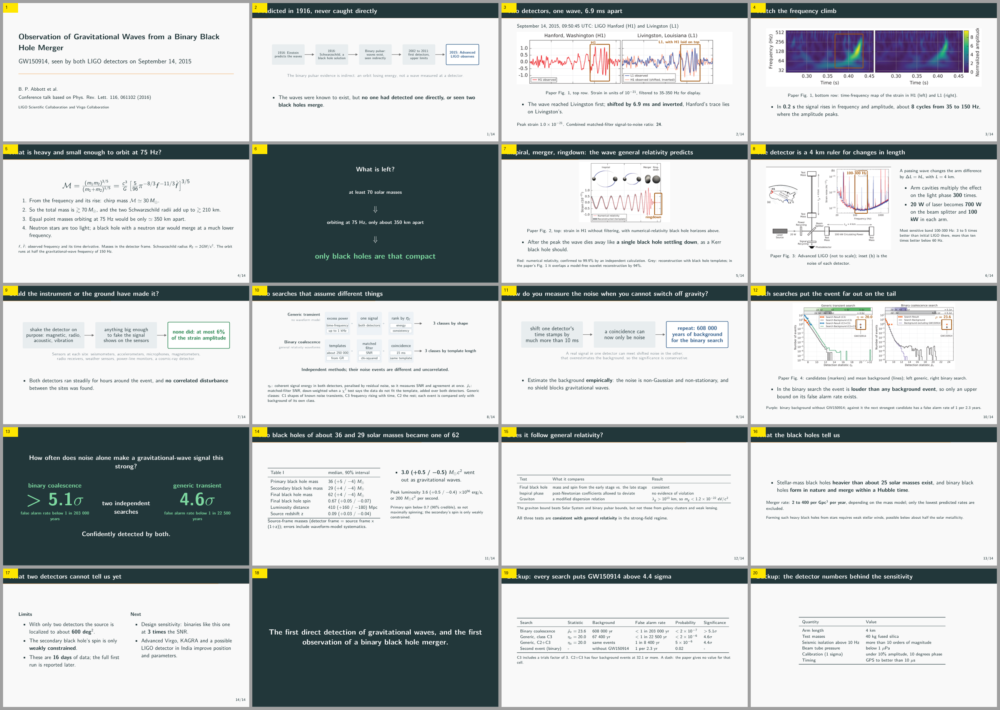

# paper2podium

paper2podium turns a finished paper into a conference talk: a PDF deck, a PowerPoint file
and a timed speaker script, all built from one source file. Its checkers then confirm that
nothing in the talk has drifted from the paper.

It is an agent skill (for Claude Code, Codex, or any agent that reads `SKILL.md`) plus the
Python tools the skill calls:

- builders for the figures, the deck, the PowerPoint and the script;
- checkers: `deckcheck`, `outcheck`, `fitcheck`, `diffcheck`, `refcheck`, `prose_audit`.

It needs no service and no API key, and nothing leaves your machine.

## Example

[`examples/gw150914/`](examples/gw150914/) is a complete 15-minute talk that an agent built
from the GW150914 detection paper (CC BY 3.0) and nothing else. It contains the PDF deck, the
PowerPoint, the timed script, and the plan that says why each slide exists.

[](examples/gw150914/)

## Quick start

You need Python 3.10+ and a TeX distribution with Beamer and the metropolis theme. See
[INSTALL.md](INSTALL.md) for details.

```bash
git clone https://github.com/kcy4334-lgtm/paper2podium
cd paper2podium
pip install -r requirements.txt
```

To use it as an agent skill instead:

```bash
npx skills add kcy4334-lgtm/paper2podium
```

Build the bundled example to check that everything works:

```bash
python scripts/build.py examples/filled-slides.yaml -o out   # figures, deck, PDF, PPTX, script
```

Then, for your own paper:

```bash
python scripts/scaffold.py paper/paper.tex -o slides.yaml   # skeleton, with TODOs
$EDITOR slides.yaml                                          # titles, and what you'll say
python scripts/build.py        slides.yaml -o out            # figures, deck, PDF, PPTX, script
cp config.example.yaml deckcheck.yaml                        # once: point it at your paper
python scripts/deckcheck.py    deckcheck.yaml --selftest   # can each check still fail?
python scripts/deckcheck.py    deckcheck.yaml
python scripts/outcheck.py     slides.yaml --deck out/talk.pdf --pptx out/talk.pptx \
                               --script out/script.md --sidecar out/figs/values.txt
```

To see what you can put in `slides.yaml`, ask the tool for its own reference:

```bash
python scripts/deckspec.py --keys        # every key, every emphasis mark
python scripts/deckspec.py slides.yaml   # validate; an unknown key is an error
```

`scaffold` does not write your talk. It extracts the section order (which becomes the slide
order), the tables, and each section's numbers. It leaves a `TODO:` wherever a person has to
decide: how to phrase a title, what you will actually say, where the impact slides go.

## The problem it solves

You have a final paper. You need a deck, a PowerPoint fallback for the venue machine, and a
script to rehearse from. Each of these is a **derivative** of the paper, and derivatives fail
in three ways:

1. A number is retyped wrong. Nobody notices until someone in the audience reads the
   slide and the table at the same time.
2. A summary claims something the paper does not. Tightening a sentence for a slide quietly
   widens its scope.
3. The three outputs drift apart. You fix a sentence on a slide and forget the script.

All three are mechanical, so the tool is designed to prevent them.

## How it works

```
paper.tex ──scaffold──▶ slides.yaml ──┬──build_deck───▶ talk.tex ──pdflatex──▶ talk.pdf
                        (you fill it) ├──build_pptx───▶ talk.pptx
                                      └──build_script─▶ script.md
                                      │                     │
                    deckcheck ◀───────┘                     │  is every number in the paper?
                    outcheck  ◀─────────────────────────────┘  did what you wrote arrive?
```

`slides.yaml` is the single source. The deck, the PowerPoint and the script are all
generated from it, so there is nothing to keep in sync and problem 3 does not arise. The
project this tool came from kept content in three separate places. It needed a rule ("change
one sentence, change all three in the same pass") and an extra checker to enforce it.
Removing the duplication cost less than enforcing the rule.

The two checkers deliberately read different things. `deckcheck` reads the source you
generated. `outcheck` reads the PDF and the PPTX that came out at the end. Anything a
renderer drops is invisible to the first and caught by the second.

## What the checker reports

Trimmed from `deckcheck.py deckcheck.yaml` on [`examples/gw150914/`](examples/gw150914/):

```
A. Are the numbers shown on the derivative in the source?
   24 decimals · 0 values not in the source
B. Key claims — on both the derivative and the source
   OK   binary search significance 5.1     derivative present · source present
   ...  (12 claims, all OK)
C. Banned phrasing — hype words + retired wording, 8 kinds
   -> 0 hit(s)
D. The script that goes out loud
   16 decimals · 0 values not in the source  · 0 banned phrase hit(s)
E. Reverse direction — values the source has that the derivative never uses
   8 kinds in the source · 0 value(s) never used anywhere in the derivative
F. PPTX <-> deck
   only in PPTX: none
   only in deck: none
G. PPTX structure
   20 slides = 14 numbered + 6 unnumbered   OK
H. Is the wording the deck uses the source's wording?
   0 kind(s) of wording not in the source, out of the deck's working vocabulary (3+ uses)
I. Is what's inside quotation marks exactly in the manuscript?
   0 quote(s) · 0 not in the manuscript
total
   all 0 — passed
```

It exits with status 1 on any failure, so it can run in CI.

## Design ideas you can use without this tool

### Read the output back, not the source you generated

Every check above reads the `.tex` or the spec, so they share one blind spot: whatever the
renderer silently dropped. `outcheck.py` opens the finished PDF and PPTX, extracts the text,
and checks that every fragment of the spec arrived. On a deck that had passed all the other
checks, it found 38 fragments that never reached the page: a subtitle line that Beamer
dropped, and six features the PPTX builder had never implemented. LaTeX reported no errors.

### Make the checker prove it can fail

A check that prints zero means either that the document is clean or that the check is
broken, and you cannot tell which. So `deckcheck.py <config> --selftest` plants a deliberate
error in sections A–D, F and I of *your* config and reports any section that does not catch
it. For E, G and H it checks that the input is not empty. It also names configurations that
cannot fail at all: an empty claims list, a `ban_file` that did not load, a coverage pattern
that matches nothing. Without the self-test, these look exactly like a clean pass.

### Reverse coverage (section E)

Most checkers ask whether what is on the slide is correct. Section E also asks what is
missing, because derivatives fail by quiet omission far more often than by visible error. In
the project this came from, two whole paragraphs of results had disappeared from the deck,
and nobody noticed until this check existed.

### Sidecars

Numbers drawn into a figure are invisible to a checker that reads source text. So the figure
generator writes what it drew to a TSV file next to the image, and the checker reads that
too. Each generator replaces only its own tagged rows, so run order does not matter.

```
fig1	<item>	<series>	27.1	5.9e-05
```

### A project-specific banned list

A long writing project collects phrasings you decided against, and then forgets them. Put
them in one file with the reason for each, and let the checker enforce it. In one project,
32 retired phrasings had come back, three of them reintroduced in the previous editing pass.

Write words in the banned list, not regexes. A regex can be valid and still match nothing,
and the output then looks the same as for a clean document. In one test, 12 of 20 patterns
matched nothing because the reason had been written on the same line and became part of the
pattern. Plain lines get word boundaries added for you; prefix a line with `re:` to mark a
real pattern. The fix that holds is the one that removes the failure mode, not the one
that detects it.

## Known traps the builders handle

The builders include fixes for problems that each cost real time:

- In a Beamer `[standout]` frame, a next line that starts with `{` is silently taken as the
  frame title. Every standout frame gets a `\vspace{0pt}` guard.
- pdflatex's default sans font has no 40pt size. A minus sign beside a big number is then
  substituted and stretched into an em dash. Big-number slides draw the minus as a rule.
- PowerPoint cannot embed fonts and does not report a table row's rendered height. The
  builder pins a system font and warns when a cell is likely to wrap.
- If the LaTeX rules are applied to a Markdown file, `%` starts a comment, half the deck
  disappears, and **the checker still reports a pass**. The checker now refuses that
  combination.
- A figure path that does not exist would stop `pdflatex` and lose the whole deck. The
  builder emits a visible placeholder and a warning instead.

You can ignore one warning. The metropolis title page reports
`Overfull \vbox (13.79993pt too high)` regardless of content: with a short title, no
subtitle, or a single slide, the warning is the same. The PDF is fine; the warning comes
from the theme, not from your deck. Look into any other overfull warning.

## Limitations

- Its evidence comes from blind test runs (a fresh agent given only the paper and the
  skill), not from a user base. It has been run end to end on several real papers this way;
  one result is published, in [`examples/gw150914/`](examples/gw150914/). The unit tests use
  synthetic fixtures on an unrelated subject. Weigh it accordingly.
- It does not plot your raw data. It draws charts from tables in the spec and diagrams
  from the spec, and it can crop and highlight a figure taken from the paper. A figure that
  needs record-level data needs your own generator; the sidecar convention makes its output
  checkable.
- Sections `A` and `E` rely on LaTeX conventions. With `syntax: plain` you keep the number
  checks but lose the structural stripping.
- It checks consistency with your source. It cannot tell whether the source is right.

## Tests

```bash
python -m unittest discover tests
```

It prints `OK` when all tests pass. The test count is deliberately not written here: it was
once written in three places, and all three had gone out of date.

Before each release the generated deck is also compiled with `pdflatex`, because LaTeX that
looks valid but does not build is the failure that matters most here.

The tests focus on negative cases: errors are injected into a synthetic fixture, and each
one must be caught. A checker can always print zero, and that alone proves nothing. For the
same reason the checker ships with

```bash
python scripts/deckcheck.py <config.yaml> --selftest
```

which plants a deliberate error in sections A–D, F and I of *your* config and names any
section that does not catch it (for E, G and H it checks that their input is not empty).
Run it once when you set up the config, and again whenever you edit it.

Writing the tests found five real defects:

- a Markdown `%` hole that silently disabled half the check;
- a shadowed variable that disabled sidecar merging;
- a broken regex in a config that made reverse coverage return zero without saying so;
- stage directions that never reached the printed script;
- a missing figure path that would have stopped the whole document from building, visible
  only once the output was compiled.

## License

MIT. See [LICENSE](LICENSE).
