# Observation of Gravitational Waves from a Binary Black Hole Merger — speaker script

Conference talk based on Phys. Rev. Lett. 116, 061102 (2016)

> Generated by `build_script.py` from `slides.yaml`. Do not edit by hand — it would drift from the deck and the PPTX.

**Total 11:39** (speech 11:01 + pauses 0:38 · at 125 wpm)

2 backup slide(s) are not in the time — open them only for questions.

---

## 1. Observation of Gravitational Waves from a Binary Black Hole Merger

`0:20`  this slide 20s  ·  pause 1s

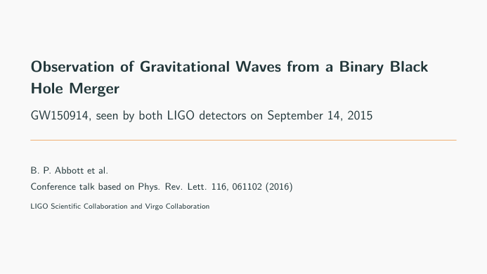

> Stand to the side of the screen. Wait for the room to settle.

I am presenting this on behalf of the LIGO Scientific Collaboration and the Virgo Collaboration.

What the two LIGO detectors saw on September 14, 2015, why it points to two black holes merging, and why it is not noise.

---

## 2. Predicted in 1916, never caught directly  ·  screen 1/14

`0:50`  this slide 30s  ·  pause 2s

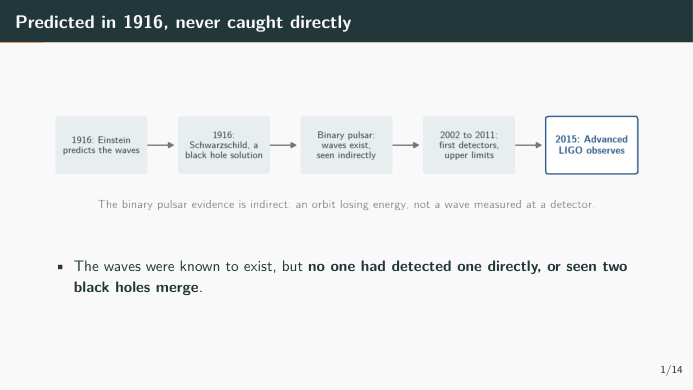

> Walk the timeline left to right, then point at the last box.

Einstein predicted these waves a century ago, and expected them to be remarkably small.

The binary pulsar found by Hulse and Taylor showed that they exist, through the energy its orbit loses.

But that is indirect. Nobody had measured the wave itself, and although many black hole candidates are known, no black hole merger had ever been observed.

---

## 3. Two detectors, one wave, 6.9 ms apart  ·  screen 2/14

`1:33`  this slide 43s  ·  pause 2s

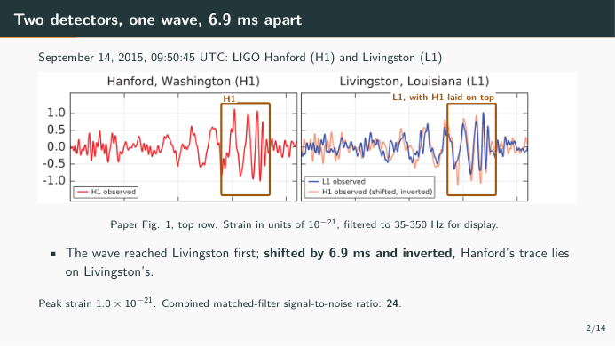

> Point at the left box, then the right box. Let them compare the two traces for a second.

09:50:45 UTC, September 14, 2015. Strain is the fractional change in length the wave causes; here it peaks at 1.0 times ten to the minus 21.

Look at the right panel. The blue line is Livingston. The orange line is Hanford, moved by 6.9 milliseconds and flipped, because the two detectors are oriented differently.

They lie on top of each other, within the 10 milliseconds light needs between the sites. Combined signal-to-noise ratio: 24.

---

## 4. Watch the frequency climb  ·  screen 3/14

`2:01`  this slide 28s  ·  pause 2s

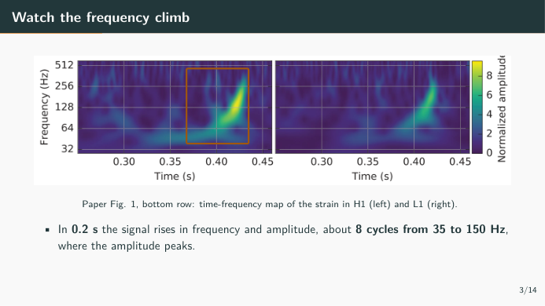

> Trace the bright track upward with your hand.

Here is the same event as a time-frequency map. Brighter means more signal.

The track bends upward: the frequency and the amplitude both grow, in about 8 cycles, until the amplitude peaks near 150 hertz.

Two orbiting masses losing energy to gravitational waves do exactly this. They spiral in, and orbit faster.

---

## 5. What is heavy and small enough to orbit at 75 Hz?  ·  screen 4/14

`3:03`  this slide 62s  ·  pause 2s

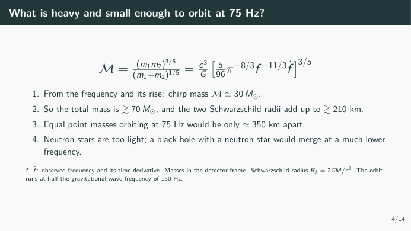

> Do not read the formula. Point at f and f-dot, then go down the steps.

The formula needs only the frequency and how fast it rises. That gives a chirp mass of about 30 solar masses, so at least 70 in total, in the detector frame. A Schwarzschild radius R_S is 2GM over c squared.

The orbit runs at half the wave frequency, so a 150 hertz wave means 75 orbits per second. Put that much mass in such an orbit: two point masses would be only 350 kilometres apart, while their Schwarzschild radii alone add up to 210 kilometres.

Neutron stars do not have the mass. A black hole and a neutron star with this chirp mass would be far heavier in total, and would merge at a much lower frequency.

---

## 6. What is left?

`3:17`  this slide 14s  ·  pause 3s

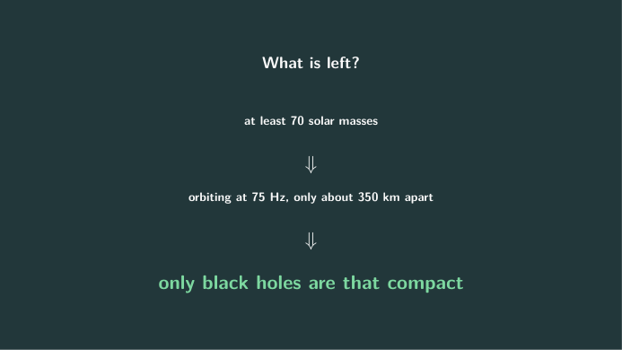

> Pause three seconds before speaking. Let them read the last line.

Black holes are the only known objects compact enough to reach that orbit without contact. So this is a binary black hole.

---

## 7. Inspiral, merger, ringdown: the wave general relativity predicts  ·  screen 5/14

`4:01`  this slide 44s  ·  pause 2s

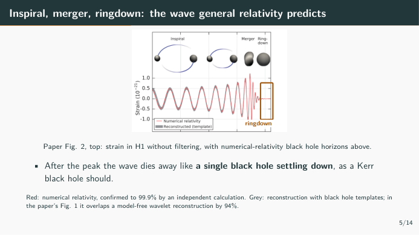

> Point at the ringdown box last.

The red line is a numerical relativity waveform for a system consistent with the measured parameters. An independent calculation confirms it to 99.9 percent.

The grey band is the signal reconstructed from the data with black hole templates. It is not the only reconstruction: one built from wavelets, with no astrophysical model, overlaps it by 94 percent.

Look at the end. After the peak, the wave decays like the damped oscillations of one black hole relaxing to a final, stationary Kerr black hole, the rotating kind.

---

## 8. The detector is a 4 km ruler for changes in length  ·  screen 6/14

`4:46`  this slide 45s  ·  pause 2s

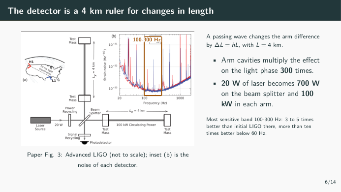

> Point at the two arms, then at the dip in the noise curve.

Before asking whether this could be noise, here is the instrument: a Michelson interferometer with two 4 kilometre arms. A wave stretches one arm and squeezes the other.

Each arm cavity multiplies the effect 300 times; 20 watts of laser become 700 watts on the beam splitter and 100 kilowatts in each arm.

The noise curve on the right is lowest between 100 and 300 hertz, where these detectors are 3 to 5 times more sensitive than initial LIGO.

---

## 9. Could the instrument or the ground have made it?  ·  screen 7/14

`5:24`  this slide 38s  ·  pause 2s

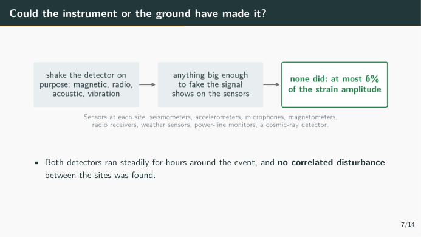

> Ask the room: what would you check first? Then point at the green box.

The obvious worry is that something local shook the mirrors.

Each site is covered with environmental sensors, and the team tested how the detectors respond to magnetic, radio, acoustic and vibration excitations. Anything strong enough to fake this signal would have shown up clearly.

None did. In the second that contained the event, environmental fluctuations could explain no more than 6 percent of the strain.

And nothing correlated turned up between the two sites.

---

## 10. Two searches that assume different things  ·  screen 8/14

`6:09`  this slide 45s  ·  pause 2s

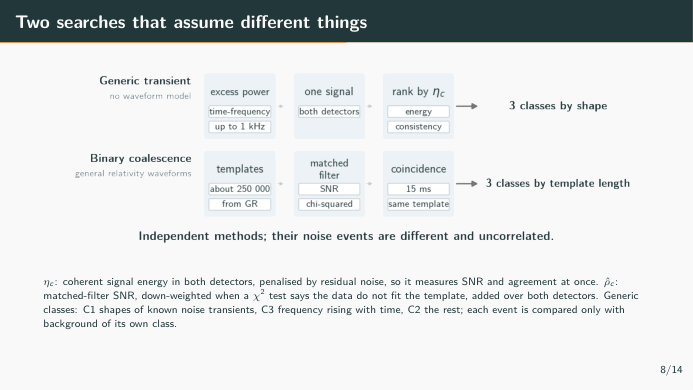

> Top row, then bottom row. Stress 'no waveform model'.

Two searches found the event, and they do not share assumptions.

The generic search needs no waveform model. Its statistic, eta-c, grows with the coherent signal energy and shrinks when the two detectors disagree.

The binary search matches about 250,000 general relativity waveforms. Its statistic, rho-hat-c, is the signal-to-noise ratio, reduced when a chi-squared test says the data do not fit the template.

Both sort events into three classes, so each event is judged only against background of its own kind.

---

## 11. How do you measure the noise when you cannot switch off gravity?  ·  screen 9/14

`6:53`  this slide 44s  ·  pause 2s

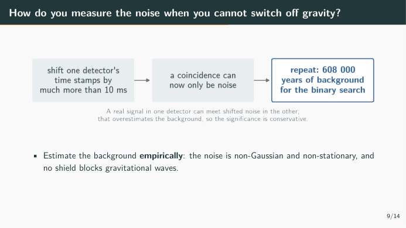

> Point at the middle box: this is the whole trick.

How often does noise alone make something this loud? The noise is not Gaussian and changes over time, so it cannot be computed. And no shield blocks gravitational waves.

So one detector's data is slid in time by far more than the 10 milliseconds between sites; any coincidence left must be noise. About ten million such shifts give 608,000 years of background, from 16 days of data.

A real signal can still leak into this background, so the estimate errs on the conservative side.

---

## 12. Both searches put the event far out on the tail  ·  screen 10/14

`7:54`  this slide 61s  ·  pause 2s

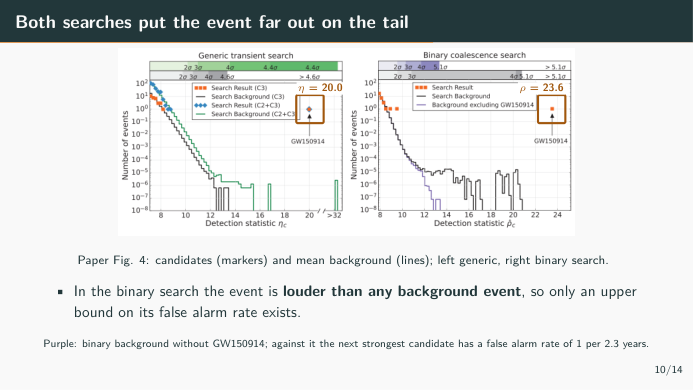

> Point at the right marker, then run your hand along the black background line to where it stops.

Markers are candidates, lines are background. On the right, the event sits at 23.6, beyond every background event.

The flat tail is the event itself in one detector, paired with noise in the other. Without it, the purple line, the next strongest candidate has a false alarm rate of 1 per 2.3 years.

On the left, the generic search finds it as its strongest event, at 20.0, in the rising-frequency class C3. That shape requirement removes noise from the background. Drop it, and compare against noise of any shape, and four background events reach 32.1: the false alarm rate becomes 1 in 8,400 years, 4.4 sigma, still significant.

---

## 13. How often does noise alone make a gravitational-wave signal this strong?

`8:21`  this slide 27s  ·  pause 3s

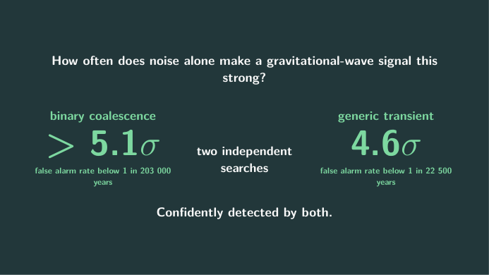

> Put it up, wait three seconds, then speak.

The binary search bounds the false alarm rate below 1 in 203,000 years, more than 5.1 sigma.

The generic search, with no waveform model at all, gives a false alarm rate lower than 1 in 22,500 years, 4.6 sigma.

---

## 14. Two black holes of about 36 and 29 solar masses became one of 62  ·  screen 11/14

`9:14`  this slide 53s  ·  pause 2s

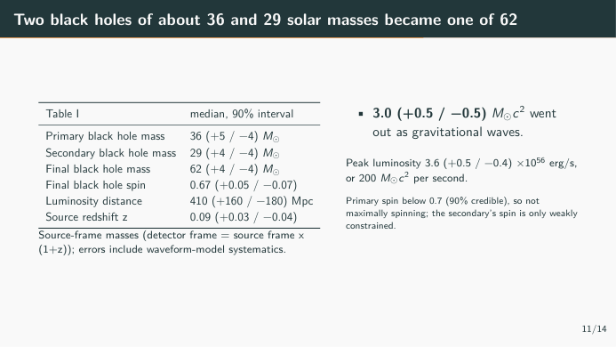

> Point at the three mass rows, then at the 3.0 on the right.

A Bayesian analysis with several waveform models gives source-frame masses; the detector-frame 70 earlier is larger by one plus the redshift. Thirty-six and twenty-nine solar masses went in, sixty-two came out. About three solar masses were radiated as gravitational waves.

At its peak the system radiated 3.6 times ten to the 56 erg/s, which is 200 solar masses of energy per second.

The primary's spin is below 0.7, so it is not maximally spinning. The source is about 410 megaparsecs away, redshift 0.09. All ranges are 90 percent credible intervals.

---

## 15. Does it follow general relativity?  ·  screen 12/14

`9:57`  this slide 43s  ·  pause 2s

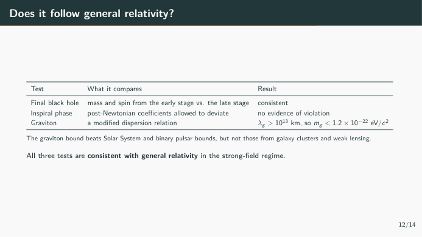

> Read the result column top to bottom, then the note.

Three checks. The final mass and spin from the early and the late part of the signal agree. The inspiral phase coefficients show no deviation.

And if the graviton had a mass, the waves would follow a modified dispersion relation. Its Compton wavelength λ must exceed ten to the 13 kilometres, so its mass is bounded below 1.2 times ten to the minus 22 electron volts. That beats the Solar System and binary pulsar bounds, but not those from galaxy clusters and weak lensing.

---

## 16. What the black holes tell us  ·  screen 13/14

`10:36`  this slide 39s  ·  pause 2s

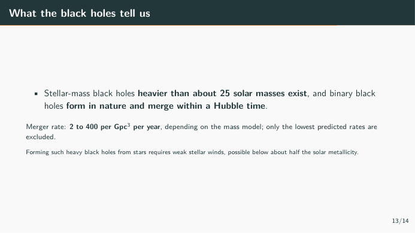

> One sentence, then the rate range. Do not overstate the rate.

It shows that black holes of more than about 25 solar masses exist, and that binaries of them form and merge within a Hubble time.

The first rate estimates range from 2 to 400 mergers per cubic gigaparsec per year, depending on the mass model. Only the lowest predictions are excluded.

For stars to leave black holes this heavy, their winds must be weak, which is possible where metallicity is below about half the solar value.

---

## 17. What two detectors cannot tell us yet  ·  screen 14/14

`11:18`  this slide 42s  ·  pause 2s

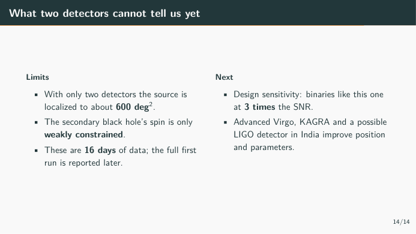

> Left column first. Do not skip the limits.

Three things this paper cannot say yet. Only LIGO was observing, so the sky position is an area of about 600 square degrees, fixed mainly by the arrival-time difference.

The spin of the smaller black hole is only weakly constrained. And these are 16 days of coincident data out of the first observing run.

At design sensitivity, such a binary would have three times the SNR, and Virgo, KAGRA and a planned detector in India will improve the positions.

---

## 18. The first direct detection of gravitational waves, and the first observation of a binary black hole merger.

`11:39`  this slide 21s  ·  pause 3s

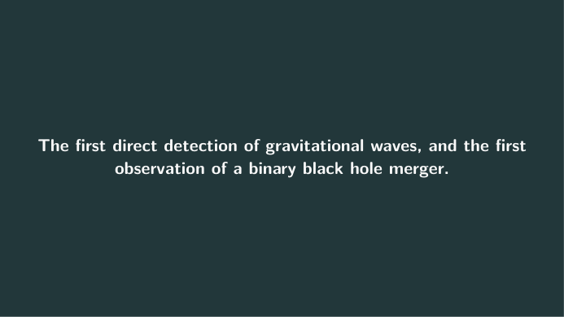

> Say it once, slowly. Then invite questions.

The detected waveform matches general relativity's prediction for two black holes spiralling in, merging, and ringing down. This is the first direct detection of gravitational waves and the first observation of a binary black hole merger. Thank you.

---

# Backup slides (after the talk)

Open these when a question calls for them. They carry no page number and no time.

## Backup: every search puts GW150914 above 4.4 sigma

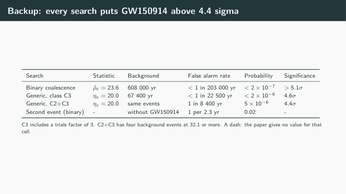

If asked: rho-hat-c and eta-c are the ranking statistics of the binary and the generic search. Here are all the significance numbers for GW150914 from both, including the two-class generic search, where four background events reach 32.1, and the second strongest candidate.

---
## Backup: the detector numbers behind the sensitivity

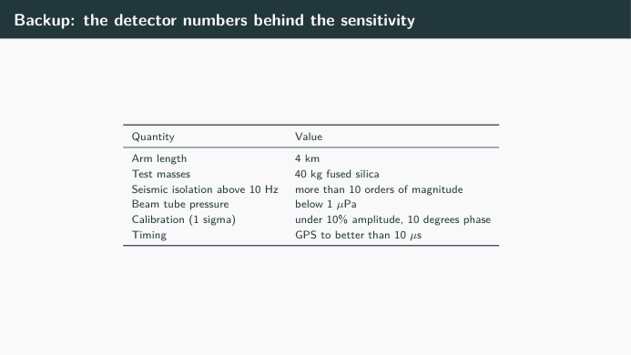

If asked about the instrument: these are the detector numbers from the paper.

---

# Likely questions

- **Q: Why is the Hanford trace inverted? A: The two detectors have different relative orientations, so the same wave appears with opposite sign.**  <!-- slide 3 · Two detectors, one wave, 6.9 ms apart -->
- **Q: Why 75 Hz and not 150 Hz? A: The orbital frequency is half the gravitational-wave frequency.**  <!-- slide 5 · What is heavy and small enough to orbit at 75 Hz? -->
- **Q: How good is the calibration? A: Better than 10 percent in amplitude and 10 degrees in phase, one sigma; see backup.**  <!-- slide 8 · The detector is a 4 km ruler for changes in length -->
- **Q: What about the second event? A: False alarm rate 1 per 2.3 years, false alarm probability 0.02; if astrophysical, it is also a binary black hole merger.**  <!-- slide 12 · Both searches put the event far out on the tail -->
- **Q: Is 5.1 sigma a measurement or a bound? A: A bound. No background event was as loud, so only an upper limit on the false alarm rate can be set.**  <!-- slide 13 · How often does noise alone make a gravitational-wave signal this strong? -->
